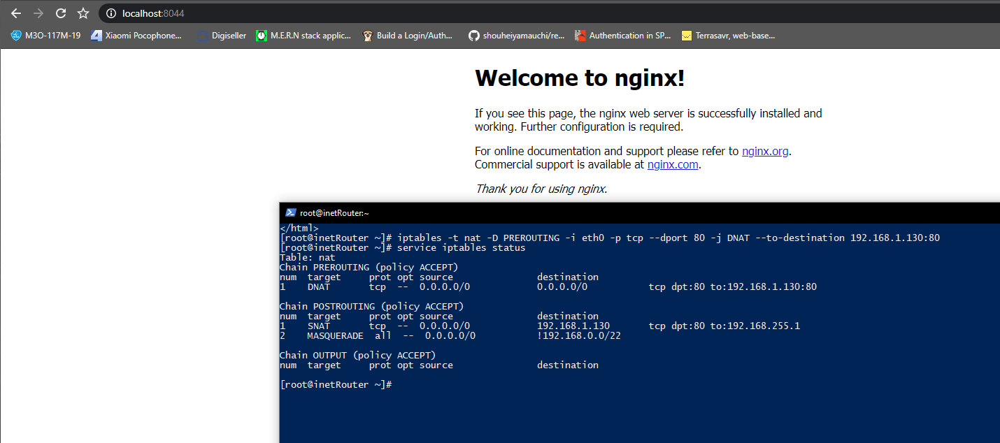

# Лабораторная работа 1
## Задание 1

Схема сети:
  ИСПРАВЬ СЕТИ
Сети: 
- 192.168.0.0
- 192.168.1.0
- 192.168.2.0

## Задание 2

### Первая сеть
Подсети:

#### 192.168.2.0/26
Узлов: 62
Broadcast: 192.168.2.63

#### 192.168.2.64/26
Узлов: 62
Broadcast: 192.168.2.127

#### 192.168.2.128/26
Узлов: 62
Broadcast: 192.168.2.191

### Вторая сеть
Подсети:

#### 192.168.1.0/25
Узлов: 126
Broadcast: 192.168.1.127

#### 192.168.1.128/26
Узлов: 62
Broadcast: 192.168.1.191

#### 192.168.1.192/26
Узлов: 62
Broadcast: 192.168.1.255

### Третья сеть
Подсети:

#### 192.168.0.0/28
Узлов: 14
Broadcast: 192.168.0.15

Самая большая подсеть: 192.168.1.0/25
Ошибок разбиения не наблюдается.

## Задание 3

### office1Server

### office2Server

### centralServer

## Задание 4
### Nginx

###  Блокировка запроса на 80 порт

### Блок ping

## Задание 5

